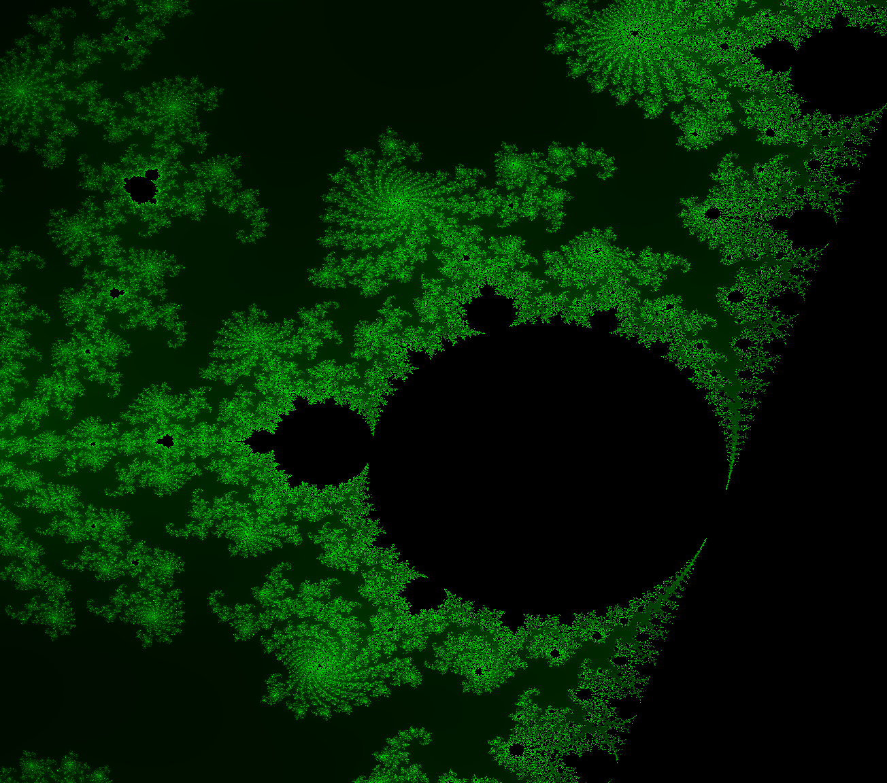

# Mandelbrotmenge
> Eine einfache Mandelbrotmenge mit C++ und OpenGL

## Bilder

## Funktionsweise
Berechnung der Mandelbrotmenge mithilfe des Fragment-Shaders.  
Dabei werden Realteil und Imaginärteil der Zahl jeweils
seperat behandelt und berechnet.

## Steuerung
**WASD**: Mandelbrotmenge bewegen  
**Leertaste**: Hineinzoomen  
**Shift**: Herauszoomen  

## Download
Free to use, gerne die bereitgestellte EXE herunterladen, kompiliert mit Visual C++ 14.

